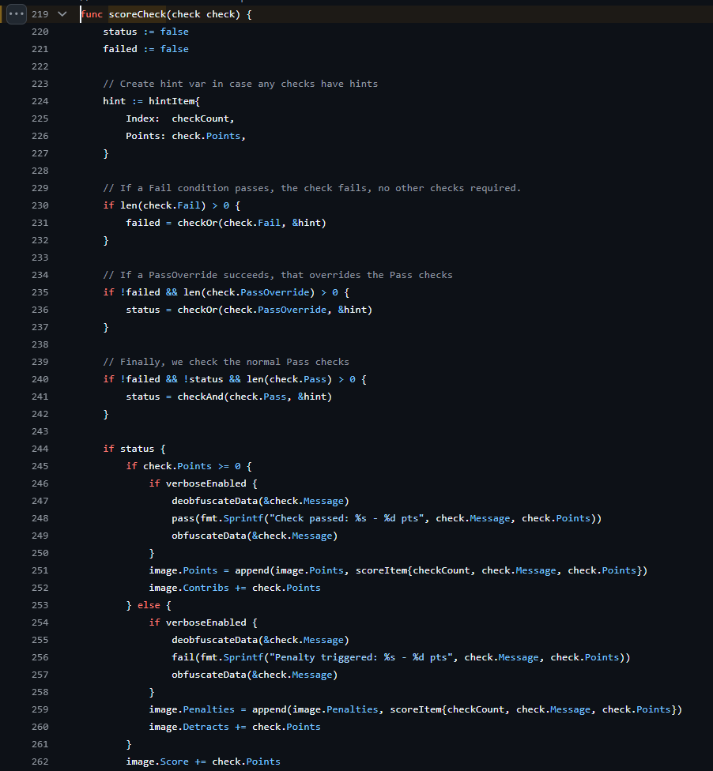
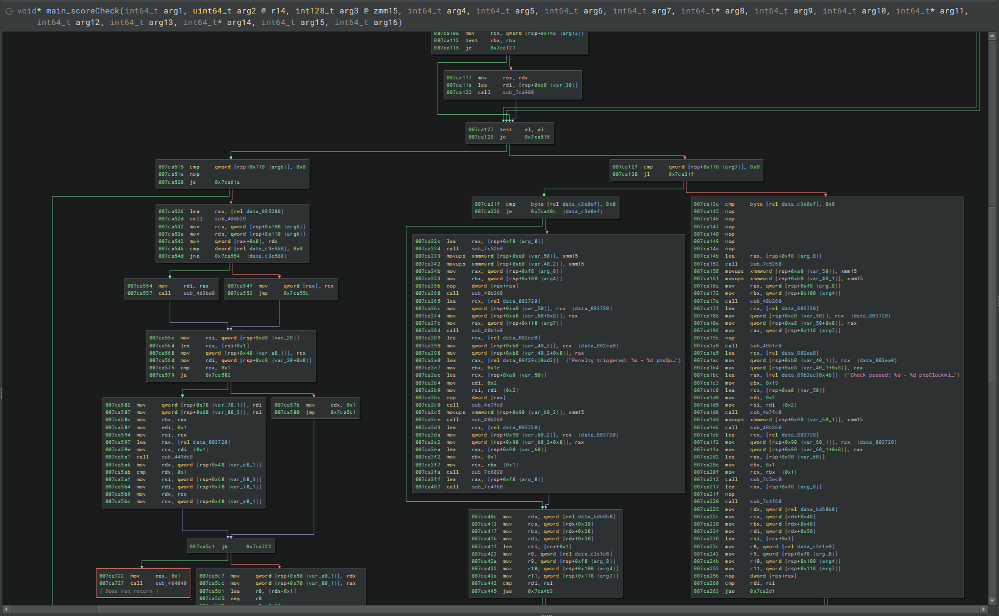
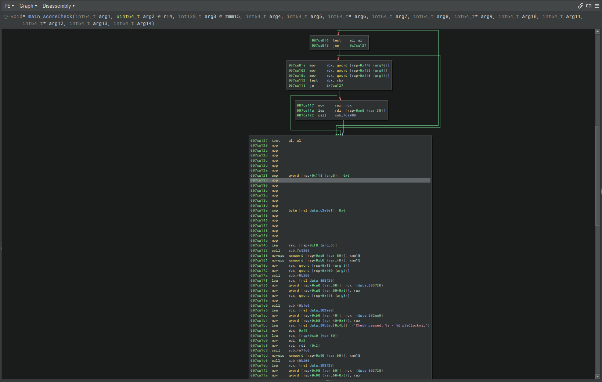

# Aeacus-100day

Aeacus is a open source image scoring system. This repo focuses on two ways to get the answers out of it.

## Decoding the .DAT file

This is relativtily easy since it is open source. We can just follow the process in the code. I have done it similar in this repo: [https://github.com/ladderlogix/eth007-image-crack/blob/main/decrypt.py](https://github.com/ladderlogix/eth007-image-crack/blob/main/decrypt.py)

## Making All checks pass

We will be attacking this function `scoreCheck`

You will need to load the go symbols(or typically found at 0x7CA020)

We see the if statements from the code from earlier. We are going to make it so we never branch.

I have written a DLL that using process hacker 2 can be injected into phocus.exe to apply this patch instead of having to edit the exe. You can find the DLL in releases.